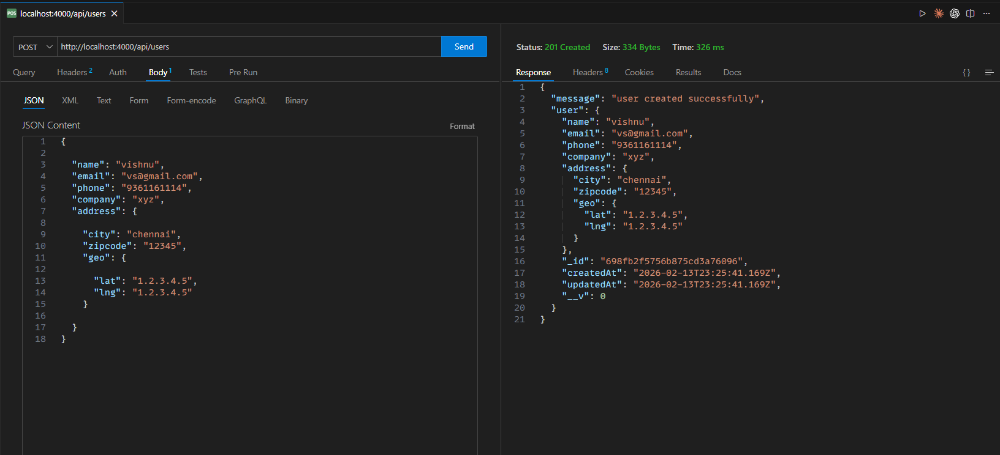
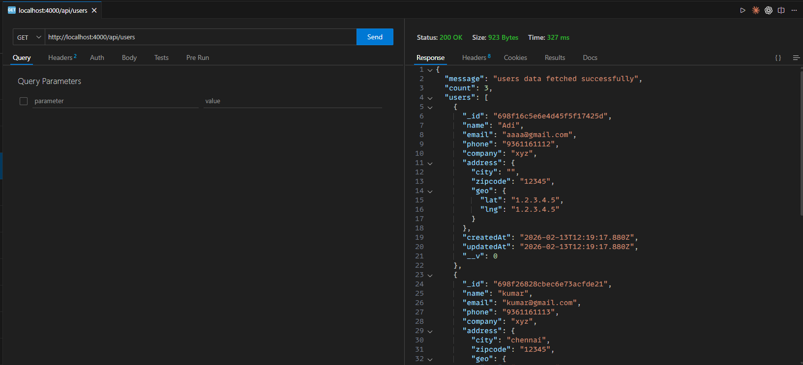
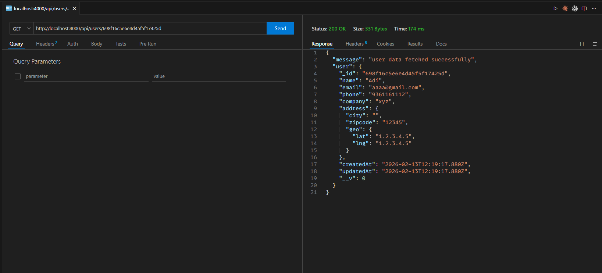
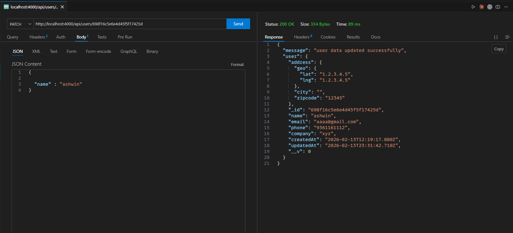
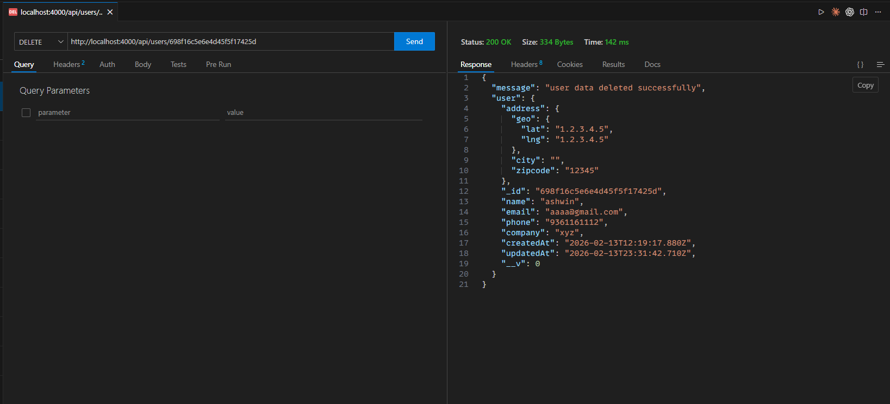

# User Management REST API

A RESTful API for managing users, built with Node.js, Express, and MongoDB (Mongoose). This API supports creating, reading, updating, and deleting users.

## Tech Stack

- **Node.js**: Runtime environment
- **Express.js**: Web framework
- **MongoDB**: Database
- **Mongoose**: ODM for MongoDB
- **TypeScript**: Programming language
- **CORS**: Middleware for cross-origin resource sharing

## Setup Instructions

1.  **Clone the repository:**

    ```bash
    git clone <repository-url>
    cd forty4-backend
    ```

2.  **Install dependencies:**

    ```bash
    npm install
    # or
    yarn install
    # or
    pnpm install
    ```

3.  **Environment Variables:**
    Copy the `.env.example` file to `.env` and update the values.

    ```bash
    cp .env.example .env
    ```

    Ensure you have a running MongoDB instance and update `MONGODB_URI`.

4.  **Run the application (Development):**

    ```bash
    npm run dev
    ```

5.  **Build and Run (Production):**
    ```bash
    npm run build
    npm start
    ```

## API Endpoints

### 1. Create a New User

Creates a new user with the provided details. Validations are in place for required fields and data formats.

- **URL:** `/api/users`
- **Method:** `POST`
- **Request Body:**
  | Field | Type | Required | Description |
  | :--- | :--- | :--- | :--- |
  | `name` | String | Yes | Full name of the user (min 2 chars) |
  | `email` | String | Yes | Valid email address (unique) |
  | `phone` | String | Yes | 10-digit phone number (unique) |
  | `company` | String | No | Company name |
  | `address` | Object | No | Address details |
  | `address.city` | String | No | City name |
  | `address.zipcode` | String | No | Zipcode |
  | `address.geo.lat` | String | No | Latitude |
  | `address.geo.lng` | String | No | Longitude |

- **Example Request:**

  ```json
  {
    "name": "xyz",
    "email": "xyz@example.com",
    "phone": "9876543210",
    "company": "abc",
    "address": {
      "city": "Mumbai",
      "zipcode": "94105",
      "geo": {
        "lat": "37.7749",
        "lng": "122.4194"
      }
    }
  }
  ```

- **Response (201 Created):**

  ```json
  {
    "message": "user created successfully",
    "user": {
      "_id": "67aeb...",
      "name": "xyz",
      "email": "xyz@example.com",
      "phone": "9876543210",
      "company": "abc",
      "address": {
        "city": "Mumbai",
        "zipcode": "94105",
        "geo": {
          "lat": "37.7749",
          "lng": "122.4194"
        }
      },
      "createdAt": "2025-02-14...",
      "updatedAt": "2025-02-14..."
    }
  }
  ```

- **Execution Screenshot:**
  

---

### 2. Get All Users

Retrieves a list of all registered users.

- **URL:** `/api/users`
- **Method:** `GET`
- **Response (200 OK):**

  ```json
  {
    "message": "users data fetched successfully",
    "count": 5,
    "users": [
      {
        "_id": "67aeb...",
        "name": "xyz",
        "email": "xyz@example.com",
        ...
      },
      ...
    ]
  }
  ```

- **Execution Screenshot:**
  

---

### 3. Get Single User

Retrieves details of a specific user by their ID.

- **URL:** `/api/users/:id`
- **Method:** `GET`
- **URL Params:** `id=[string]` (MongoDB Object ID)
- **Response (200 OK):**
  ```json
  {
    "message": "user data fetched successfully",
    "user": {
      "_id": "67aeb...",
      "name": "xyz",
      ...
    }
  }
  ```
- **Response (404 Not Found):**

  ```json
  {
    "message": "User not found"
  }
  ```

- **Execution Screenshot:**
  

---

### 4. Update User

Updates the details of an existing user. Only provided fields will be updated.

- **URL:** `/api/users/:id`
- **Method:** `PATCH`
- **URL Params:** `id=[string]`
- **Request Body:** (Example updating company and city)
  ```json
  {
    "company": "abcd",
    "address": {
      "city": "Chennai"
    }
  }
  ```
- **Response (200 OK):**

  ```json
  {
    "message": "user data updated successfully",
    "user": {
      "_id": "67aeb...",
      "name": "xyz",
      "company": "abcd",
      "address": {
        "city": "Chennai",
        ...
      },
      ...
    }
  }
  ```

- **Execution Screenshot:**
  

---

### 5. Delete User

Permanently deletes a user from the database.

- **URL:** `/api/users/:id`
- **Method:** `DELETE`
- **URL Params:** `id=[string]`
- **Response (200 OK):**

  ```json
  {
    "message": "user data deleted successfully",
    "user": {
      "_id": "67aeb...",
      "name": "xyz",
      ...
    }
  }
  ```

- **Execution Screenshot:**
  
